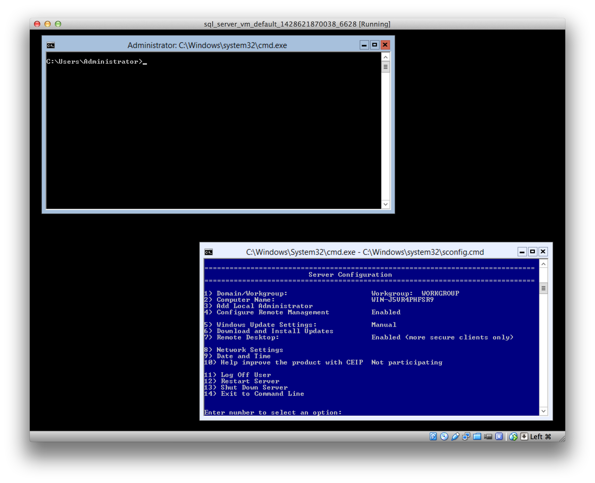

A lightweight VM with SQL Server 2014 Express

Note: If you just need Windows Hyper-V Server 2012 R2 and do not need SQL Server Express, then you might want to check out https://github.com/msabramo/vagrant_hyperv_server_free instead.

# Prerequisites

- [Vagrant][]
- [VirtualBox][]

# Install and start up

The first time that you do this it will download a large Vagrant box
file (about 2.7 GB) from the Internet, so you may want to wait until you
have a good connection.

```bash
vagrant up
```

If this works, then (perhaps after a long time downloading),
a new VirtualBox window should appear and it will boot into a
very stripped-down Windows environment
with 2 windows and no start menu, task bar, system tray, etc.



You won't see any sign of SQL Server running, but hopefully you
can connect to it from your host machine...

# Connect to database remotely from host machine

To verify that the VM started and that you can connect to the database
from your host machine, you can use the `tsql` utility bundled
with [FreeTDS][]. E.g.:

```
$ echo "SELECT @@VERSION\nGO" | tsql -H localhost -p 1433 -U vagrant -P vagrant -o q

Microsoft SQL Server 2014 - 12.0.2000.8 (X64)
  Feb 20 2014 20:04:26
  Copyright (c) Microsoft Corporation
  Express Edition (64-bit) on Windows NT 6.3 <X64> (Build 9600: )
```

You could also try connecting via Python with [pymssql][]:

```
$ ipython
Python 2.7.9 (v2.7.9:648dcafa7e5f, Dec 10 2014, 10:10:46)
Type "copyright", "credits" or "license" for more information.

IPython 2.0.0 -- An enhanced Interactive Python.
?         -> Introduction and overview of IPython's features.
%quickref -> Quick reference.
help      -> Python's own help system.
object?   -> Details about 'object', use 'object??' for extra details.

In [1]: import pymssql

In [2]: conn = pymssql.connect(server='localhost', user='vagrant', password='vagrant')

In [3]: cursor = conn.cursor()

In [4]: cursor.execute("SELECT @@VERSION")

In [5]: row = cursor.fetchone()

In [6]: print(row)
(u'Microsoft SQL Server 2014 - 12.0.2000.8 (X64) \n\tFeb 20 2014 20:04:26 \n\tCopyright (c) Microsoft Corporation\n\tExpress Edition (64-bit) on Windows NT 6.3 <X64> (Build 9600: )\n',)
```

or you could connect with a tool such as [DbVisualizer][] or [SQuirreL SQL Client][].


# Details

You now have a VirtualBox VM with:

- [Microsoft Hyper-V Server 2012 R2][Hyper-V Server] – free, stripped-down
  version of Windows; has very little GUI or admin/desktop tools, but it's good
  enough to run SQL Server Express and it can be managed remotely via PowerShell.
- [Chocolatey][] (a package manager for easily installing software in Windows)
- [PuTTY][] (client for ssh/telnet/etc.)
- git (version 1.9.5.msysgit.1) - installed via [Chocolatey][]. This
  comes with a bunch of other UNIX utilities like: awk, bash, bzip,
  diff, du, find, gpg, grep, less, openssl, scp, ssh, tar, etc.
- [SQL Server Express][] 2014 (free version of SQL Server) - installed
  via a [Chocolatey][] package called [MsSqlServer2014Express][]. I've
  configured it as follows:

  - Listens on TCP port 1433
  - Uses mixed mode authentication; so it allows SQL Server Authentication; not just Windows Authentication
  - Has a login called `vagrant` with password `vagrant`
  - Management tools (e.g.: SSMS) are **not** included, as these are not
    supported on the free Hyper-V Server product. However, [SQLCMD][] is available.

# Tips

- You can get a bash shell by executing `"git bash"` (with quotes) at
  the command prompt. From this shell, you can access a bunch of UNIX
  utilities, including some that you can't use from the Windows command
  prompt like vim and gitk. You can see all of the available stuff in
  `/usr/bin`.
- perl (v5.8.8) is available, if that's the way you roll.
- If you want more UNIX goodies, you can install [Cygwin][] with `choco
  install -y cyg-get` in a command prompt or PowerShell. This will
  create a basic Cygwin install in `C:\tools\cygwin`.
- If you accidentally close the command prompt window and need to open
  another, press Ctrl + Alt + Del and pick "Task Manager". Then in the
  `File` menu, choose "Run new task" and type `cmd` and hit Enter.
- Port 1433 on the host is forwarded to port 1433 on the guest, so from
  the host, you can connect to SQL Server Express by connecting to
  `localhost:1433`.
- You can [RDP][] to the host by doing `vagrant rdp`.
- `vagrant ssh` will not work out of the box,
because the guest has no ssh server. If you are
determined to use ssh, you can look into
installing an ssh server like [winsshd][] (Bitvise SSH Server)], [freesshd][],
the openssh package from Cygwin, etc. but you might be able to live without
an ssh server, because you hopefully don't need to do much with the VM, or
if you need to customize things, hopefully you can do it DevOps-style and
do it by adding PowerShell commands to the `Vagrantfile` or use ansible (which can
also send PowerShell commands over WinRM), etc.
- To see the list of services that are running, you can do `net start` from the
command prompt or PowerShell.

[Vagrant]: https://www.vagrantup.com/
[VirtualBox]: https://www.virtualbox.org/
[FreeTDS]: http://www.freetds.org/
[pymssql]: http://pymssql.org/
[Hyper-V Server]: https://technet.microsoft.com/en-us/library/hh833684.aspx
[SQL Server Express]: http://www.microsoft.com/en-us/server-cloud/products/sql-server-editions/sql-server-express.aspx
[Chocolatey]: https://chocolatey.org/
[PuTTY]: http://www.chiark.greenend.org.uk/~sgtatham/putty/
[MsSqlServer2014Express]: https://chocolatey.org/packages/MsSqlServer2014Express
[devmonkeys/database]: http://code.corp.surveymonkey.com/devmonkeys/database
[SQLCMD]: https://msdn.microsoft.com/en-us/library/ms162773.aspx
[Cygwin]: https://www.cygwin.com/
[RDP]: http://en.wikipedia.org/wiki/Remote_Desktop_Protocol
[winsshd]: https://www.bitvise.com/ssh-server
[freesshd]: http://www.freesshd.com/
[DbVisualizer]: https://www.dbvis.com/
[SQuirreL SQL Client]: http://squirrel-sql.sourceforge.net/
